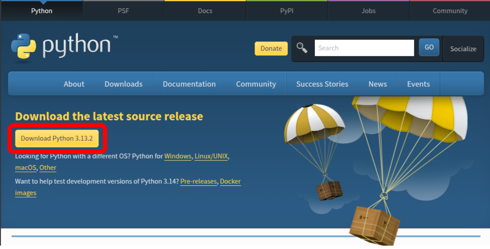
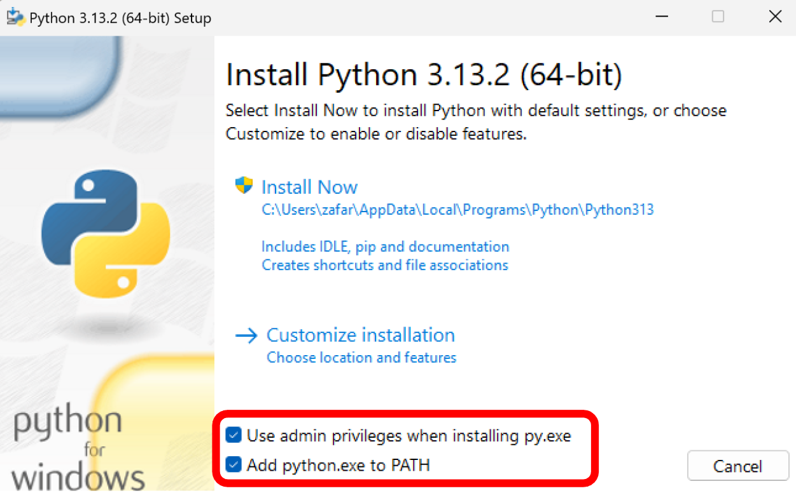
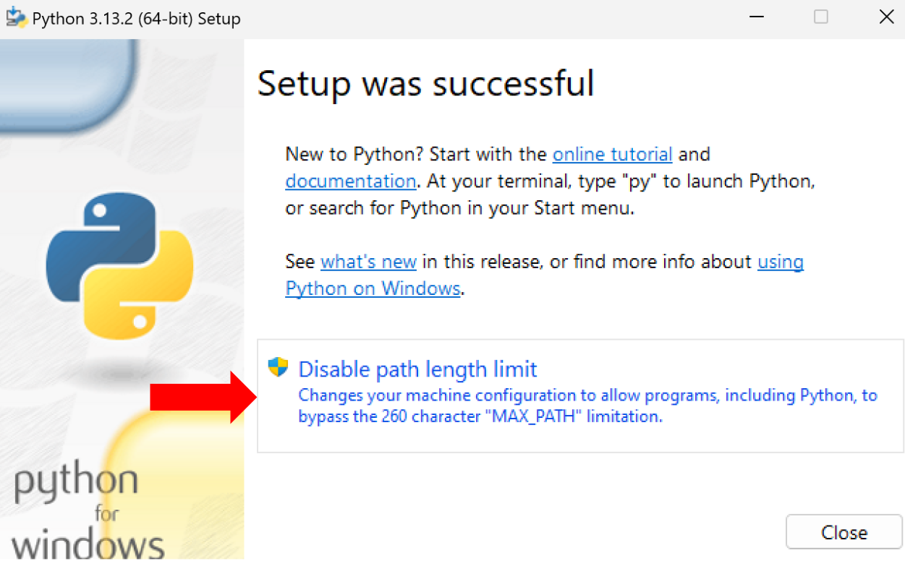

# Installation

## NeuroFlow

A Python 3+ installation is required to run NeuroFlow. See Python installation instructions below if you do not have it installed on your current system.

It is recommended to install NeuroFlow in a virtual environment in order to avoid package and versioning conflicts across Python libraries. See [Using virtual environments](./useful-info.md#using-virtual-environments) for more information.

To install NeuroFlow:

1. [Open a terminal](./useful-info.md#using-the-terminal)  and run the installation command:

```
pip install git+https://github.com/neurocog-mobility/neuroflow.git
```

2. Test the installation and view all available commands:

```
neuroflow --help
```

### Upgrading NeuroFlow

Once installed, to upgrade to a newer release add the ```--upgrade``` flag:

```
pip install --upgrade git+https://github.com/neurocog-mobility/neuroflow.git
``` 


## Python

!!! note "Important"
    Installing multiple versions of Python on a system can raise several errors.
    If you already have Python 3+ installed, skip this section.
    To check what version of Python you have installed before proceeding, have a look at [Checking Python version](./useful-info.md#checking-python-version).

### Downloading Python

Start by downloading the official installer for your system:

1. Navigate to the official Python release page: |python_link|.

2.
    Click the ``Download Python`` link.




### Installing Python
    
Navigate to the downloaded Python installer and run it:

1. Ensure both the ``Use admin privileges`` and the ``Add python.exe to PATH`` checkboxes are selected.

2.
    Click ``Install Now``.



3.
    After the installation completes, click ``Disable path length limit`` before closing the installer.

