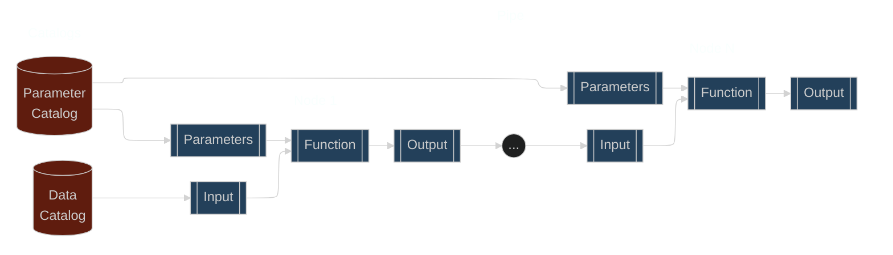

```mermaid
---
config:
  theme: dark
  layout: elk
  themeVariables: {
    clusterBorder: '#ffffff',
    clusterBkg: '#ffffff20'
    }
  elk:
    mergeEdges: false
    nodePlacementStrategy: LINEAR_SEGMENTS
---
graph LR
    style N11 fill:#23405a
    style N12 fill:#23405a
    style N13 fill:#23405a
    style N14 fill:#23405a
    style N21 fill:#23405a
    style N22 fill:#23405a
    style N23 fill:#23405a
    style N24 fill:#23405a

    style D1 fill:#5f1c0e
    style P1 fill:#5f1c0e

    subgraph Pipe
    subgraph Node 1
    N11[[Function]]
    N12[[Input]]
    N13[[Parameters]]
    N14[[Output]]
    end

    N(( ... ))

    subgraph Node N
    N21[[Function]]
    N22[[Input]]
    N23[[Parameters]]
    N24[[Output]]
    end
    end

    subgraph Catalogs
    P1[(Parameter<br/>Catalog)]
    D1[(Data<br/>Catalog)]
    end

    N12 & N13 --> N11
    N11 --> N14

    N22 & N23 --> N21
    N21 --> N24

    N14 --> N --> N22

    P1 --> N13 & N23
    D1 --> N12
    
```