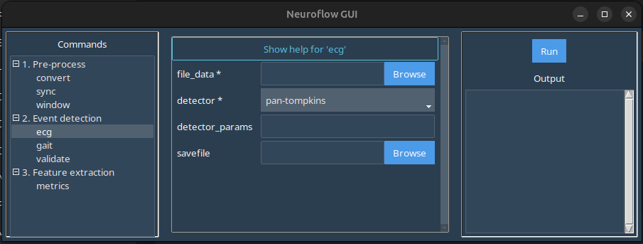

# ```ecg```

The ```ecg``` command allows you to run ECG event detectors (see [available ECG modules](../../analysis.md#ecg) for details).

In the GUI, selecting the ```ecg``` command in the left-hand panel produces this screen:



Here:

-  ```file_data```: Launches a file browser where you should select a standardized NeuroFlow .CSV file to run ECG event detection on.
- ```detector```: Select the detector from the dropdown.
- ```detector_params```: Enter any custom parameters (see the parameters listed under each [detector](../../analysis.md#ecg) for reference) as a dictionary-like string ({"parameter_one": value_one, "parameter_two": value_two, ...})

- ```savefile```: Browse/enter the filepath for the exported .CSV file. If left blank, the exported .CSV file will be automatically named and placed in the same folder as the source file.

## Example

Download the sample standardized Bittium .CSV data here: [data-ecg.zip](static/data-ecg.zip)

In the GUI window:

1. Under ```file_data``` select the extracted *neuroflow-bittium.csv* file.
3. Select *pan-tompkins* from the ```detector``` dropdown.
5. Set ```savefile``` or leave blank for default export path.
6. Click ```Run``` in the right-hand panel to export a .CSV file with gait data appended to the source data.