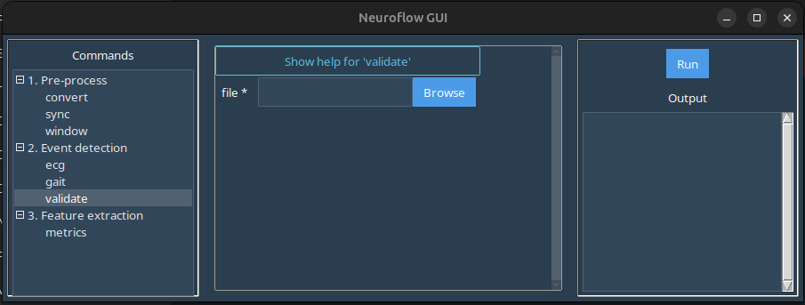
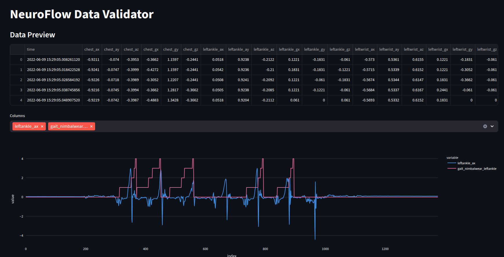
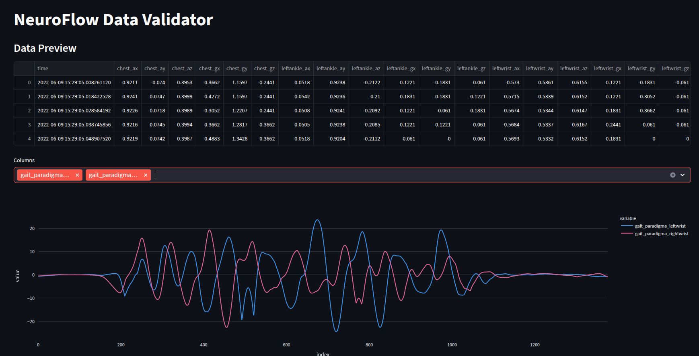
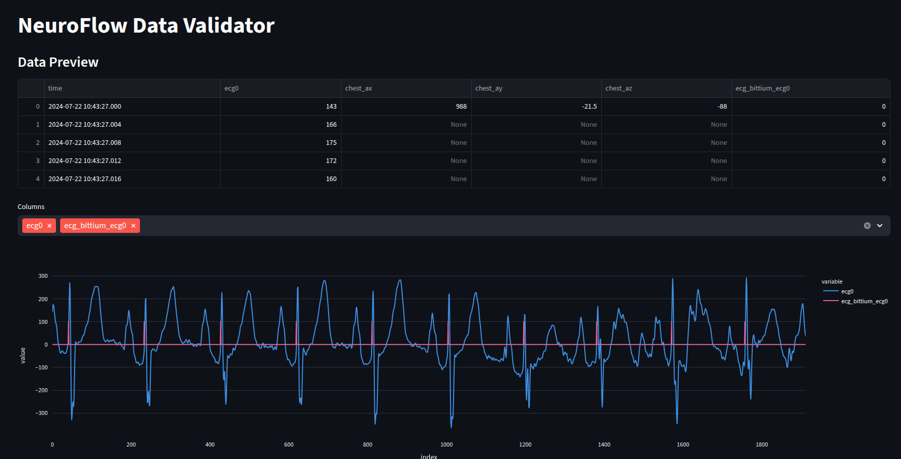

# ```validate```

The ```validate``` command allows you to inspect data signals to check data/event detector quality.

In the GUI, selecting the ```validate``` command in the left-hand panel produces this screen:



Here:

-  ```file```: Launches a file browser where you should select a standardized NeuroFlow .CSV file to load into the validation interface.

## Examples

### Step detection

Download the sample processed Axivity and Bittium .CSV data here: [data-validate.zip](static/data-validate.zip)

In the GUI window:

1. Under ```file``` select one of a processed .CSV files.
2. Click ```Run``` in the right-hand panel to launch the validation interface in a browser window.

You should see a table with sample data, along with a prompt to select columns. Selected columns will produce an interactive plot to inspect signals.

* *neuroflow-axivity_events-gait_detector-nimbalwear-ankles.csv*


* *neuroflow-axivity_events-gait_detector-paradigma-wrists.csv*


* *neuroflow-axivity_events-gait_detector-pan-tompkins.csv*
