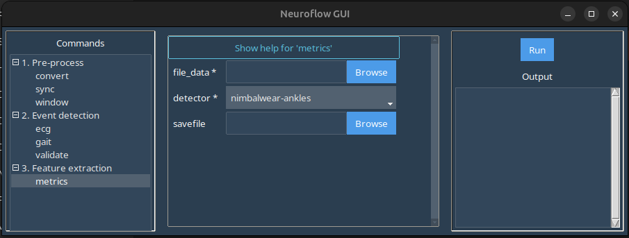

# ```metrics```

The ```metrics``` command allows you to create summary reports based on detected events (see the metrics listed under each [detector](../../analysis.md) for reference).

In the GUI, selecting the ```metrics``` command in the left-hand panel produces this screen:



Here:

-  ```file_data```: Launches a file browser where you should select a processed NeuroFlow .CSV file to summarize detected events from.
- ```detector```: Select the source detector for the events to be summarized from the dropdown.
- ```savefile```: Browse/enter the filepath for the exported .CSV summary file. If left blank, the .CSV summary file will be automatically named and placed in the same folder as the source file.

## Example

Download the sample processed Axivity and Bittium .CSV data here: [data-metrics.zip](static/data-metrics.zip)

In the GUI window:

1. Under ```file_data``` select one of a processed .CSV files.
2. Select the appropriate ```detector``` for the file you chose to summarize.
2. Click ```Run``` in the right-hand panel to generate the summary .CSV file.