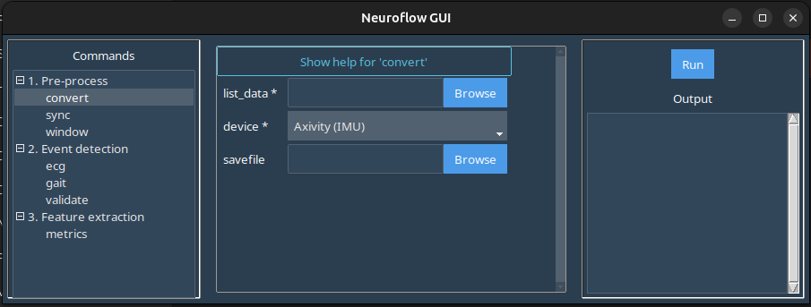

# ```convert```

The ```convert``` command allows you to transform raw data files from select modalities into a standardized .CSV file (i.e. standardized formatting, column names, etc.) to facilitate downstream processing.

In the GUI, selecting the ```convert``` command in the left-hand panel produces this screen:



!!! note "Important"
    This command is intended for converting short collections (i.e. small files) that can be loaded into the computer's memory - if you are working with free-living data (i.e. a period of collection >24 hours), the use the [```sync```](pre-sync.md) or [```window```](pre-window.md) commands to directly stream the sensor data and split into event/window .CSV files to pre-process your data.


Here:

-  ```list_data```: Launches a file browser where you should select the file to be converted.

    !!! note "Note"
        In the case of modalities where there are multiple files per capture (e.g. Axivity files where there are multiple sensor files), select all the files that correspond to the data capture.

- ```device```: Select the modality to be converted from the dropdown.
- ```savefile```: Browse/enter the filepath for the converted .CSV file. If left blank, the converted .CSV file will be automatically named and placed in the same folder as the raw files.

## Example

Download the sample Axivity data here: [data-convert.zip](static/data-convert.zip)

In the GUI window:

1. Under ```list_data``` select all the extracted .CWA files.
2. Ensure *Axivity (IMU) is selected in the ```device``` dropdown.
3. Set ```savefile``` or leave blank for default export path.
4. Click ```Run``` in the right-hand panel to produce the .CSV