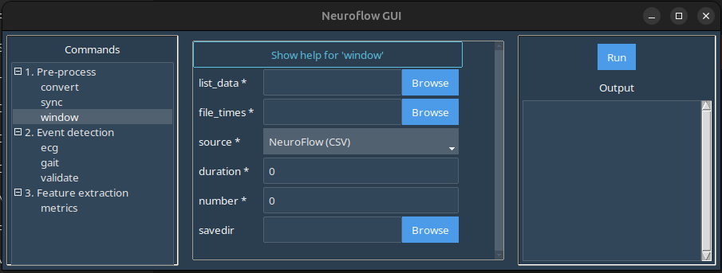

# ```window```

The ```window``` command allows you to split continuous data recordings into windows based on a reference time.

In the GUI, selecting the ```window``` command in the left-hand panel produces this screen:



Here:

-  ```list_data```: Launches a file browser where you should select the file to be split.

    !!! note "Important"
        In the case of modalities where there are multiple files per capture (e.g. Axivity files where there are multiple sensor files), select all the files that correspond to the data capture.

- ```file_times```: Launches a file browser where you should select the file containing reference timestamps.
- ```source```: Select the source for the files selected in ```list_data```.
    - If the ```convert``` command was used to produce a standardized .CSV then ensure *NeuroFlow (CSV)* is selected.
    - If splitting a longer, free-living recording directly from raw data, then select the corresponding source modality for the raw file(s).
- ```duration```: Set the duration for each window in seconds.
- ```number```: Set the number of windows to extract pre/post the reference timestamp (e.g. 5 would mean 10 windows total: 5 pre and 5 post).
- ```savefile```: Browse/enter the filepath for the split .CSV files. If left blank, the split .CSV files will be automatically named and placed in an *events* subfolder created in the same folder as the source files.

## Example

Download the sample standardized Axivity and reference timestamp .CSV data here: [data-window.zip](static/data-window.zip)

In the GUI window:

1. Under ```list_data``` select the extracted *sub-01_ses-01_neuroflow-axivity.csv* file.
2. Under ```file_times``` select the extracted *sub-01_ses-01_time.csv* file.
3. Ensure *NeuroFlow (CSV) is selected in the ```source``` dropdown.
4. Set a ```duration``` of 10 seconds and set the ```number``` of windows as 3.
5. Set ```savefile``` or leave blank for default export path.
6. Click ```Run``` in the right-hand panel to produce the *events* subfolder with individual event .CSV files.